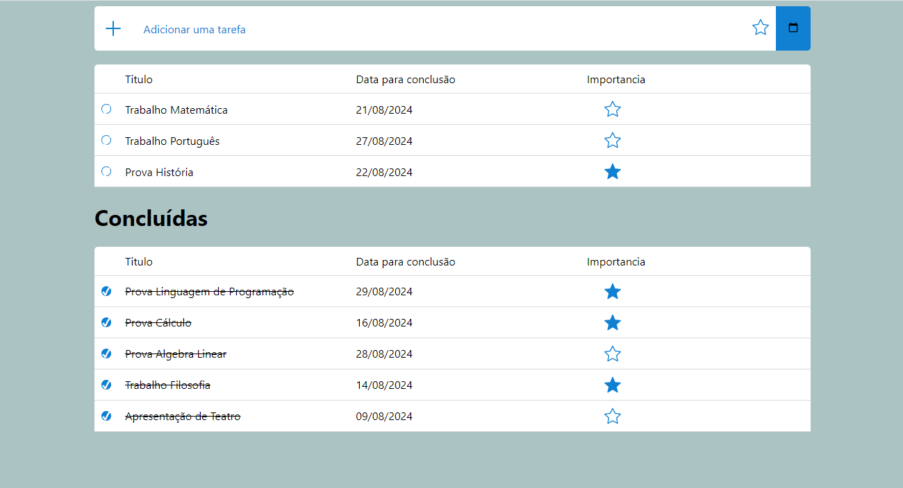

<h1 align="center">✅ ToDo List — Gerenciador de Tarefas</h1>

<p align="center">
  Uma aplicação completa para organização de tarefas, utilizando React no frontend e Node.js + MongoDB no backend 🚀
</p>

---

### 📌 Tecnologias Utilizadas

#### 🖥️ Frontend
<div>
  
  
  
  
</div>

#### 🛠️ Backend
<div>
  
  
  
</div>

---

### ✨ Funcionalidades

✔ Criar novas tarefas  
✔ Visualizar lista de tarefas  
✔ Editar tarefas  
✔ Marcar como concluídas  
✔ Excluir tarefas  
✔ API REST integrada ao frontend  
✔ Dados persistidos no MongoDB  
✔ Interface dinâmica e responsiva com React

---

### 🖼️ Layout



---

## 🚀 Como executar o projeto na sua máquina

#### 🔹 Clonar o projeto

```bash
git clone https://github.com/miguelfelipe09/toDoList.git
cd toDoList
```

---

#### 🔹 Backend

#### 📌 Pré-requisitos
- Node.js instalado ✅
- MongoDB Atlas ou MongoDB Local ✅

---

```bash
# entrar na pasta do backend
cd backend

# instalar dependências
npm install

# criar e configurar o arquivo .env
MONGO_URI=sua_string_de_conexao_mongodb
PORT=5000

# executar o servidor
npm start
```

---

```bash
# entrar na pasta do frontend
cd ../frontend

# instalar dependências
npm install

# executar aplicação
npm run dev
```

---

👨‍💻 Autor

Miguel Felipe da Silva

📎 LinkedIn: https://www.linkedin.com/in/miguel-felipe-aab18523a/
